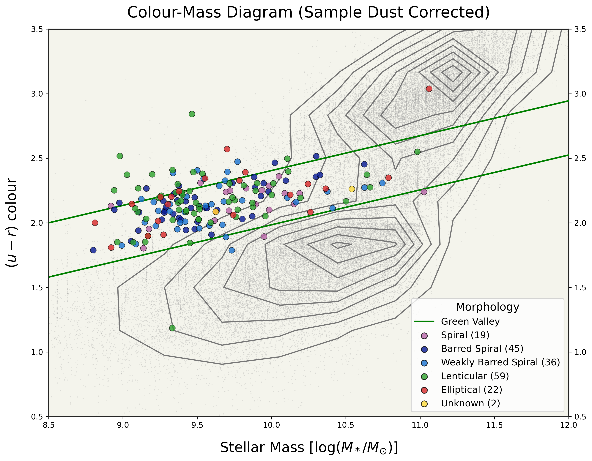

### MaNGA Color Analysis Tools

[](https://www.python.org/)
[](https://opensource.org/licenses/MIT)

Comprehensive color-mass and color-magnitude analysis suite with empirically-derived green valley boundaries and dust corrections for SDSS-IV MaNGA galaxy samples.

## Overview

This toolkit provides methods for analyzing galaxy evolution through color-mass diagrams with explicit green valley modeling. Developed for post-starburst galaxy research, these tools implement uniform dust corrections, empirically-derived evolutionary boundaries, and mass-scaling visualizations to place galaxies in evolutionary context.

**Key Innovation:** Explicitly defines green valley boundaries (typically referenced but rarely quantified in literature) using balanced sampling of blue cloud and red sequence populations from large SDSS catalogs.

## Features

- **Dust Correction Implementation:** Uses Schlegel+ extinction maps with Zhang & Yuan (2022) extinction coefficients
- **Empirically-Derived Green Valley Boundaries:** Quantitative definitions from balanced 50k+ galaxy samples
- **Multi-Color Analysis:** (u-r), (g-r), and (u-g) color indices
- **Mass-Scaling Visualization:** Marker size and colormap encode stellar mass information
- **Contour Density Mapping:** 10×10 binning reveals population structure
- **Morphology Integration:** Supports MVM-VAC morphological classifications (Vázquez-Mata+ 2022)

## Example Output

The toolkit generates publication-quality visualizations demonstrating the evolutionary positioning of galaxy samples within established color-mass-magnitude space.

### Color-Mass Diagram with Morphology Classification



**Figure:** (u-r) color vs. stellar mass for 183 E+A galaxies from SDSS-IV MaNGA DR17. Galaxies are color-coded by morphological type from the MVM-VAC (Vázquez-Mata+ 2022): spirals (purple), barred spirals (dark blue), weakly barred spirals (light blue), lenticulars (green), ellipticals (red), and unknown (yellow). Background contours show density distribution of 50,000 random SDSS galaxies. Green lines delineate empirically-derived green valley boundaries following Greene (2026) methodology. The sample demonstrates morphology-evolution decoupling: 44% lenticular, 43% spiral, 13% elliptical, all occupying the transitional green valley regardless of structural type.

### Color-Magnitude Diagrams (Two-Panel Comparison)


**Figure:** Two-panel comparison showing (u-g) vs. M_g (left) and (g-r) vs. M_r (right) for the same 183 galaxy sample. Marker size scales with stellar mass, revealing the mass-dependent nature of the green valley across different color indices. This multi-wavelength view confirms consistent sample positioning in the transitional evolutionary zone between the blue cloud (star-forming) and red sequence (passive) populations. The dual-panel presentation demonstrates the toolkit's capability to produce comprehensive multi-color analysis in a single, publication-ready figure.

### Key Features Demonstrated

- **Contour density mapping** reveals bimodal (blue cloud + red sequence) population structure in background
- **Green valley boundaries** explicitly defined and validated against literature (Schawinski+ 2014, Eales+ 2018)
- **Morphology-based coloring** shows diversity across Hubble types within a single evolutionary state
- **Mass-scaling visualization** encodes additional information through marker size and colormap
- **Multi-panel layouts** enable comprehensive color-index comparisons in single figures
- **Publication-ready formatting** with proper labels, legends, and professional aesthetics (300 DPI)

### Technical Specifications

- **Output Format:** PNG
- **Resolution:** 300 DPI (publication quality)
- **Dimensions:** 12" × 9" (single panel); 18" × 9" (two-panel)
- **File Size:** 2-5 MB per plot
- **Color Space:** RGB
- **Dust Correction:** Applied using Zhang & Yuan (2022) extinction coefficients with E(B-V) = 0.08

These figures are from Greene (2026) dissertation, Chapter 3: "A Complete Catalog of Post-starburst, E+A Galaxies in SDSS-IV MaNGA (MPL-11)."

## Scientific Context

Traditional studies reference the "green valley" as a transitional region between star-forming (blue cloud) and quiescent (red sequence) populations, but rarely provide explicit boundary definitions. This toolkit addresses that gap by:

1. Filtering large random samples to achieve balanced blue/red representation
2. Modeling tri-modal population structure following Eales+ methodology
3. Extracting quantitative boundaries at specified mass intervals
4. Validating against Schawinski+ evolutionary tracks

**Result:** Reproducible, quantitative green valley boundaries for (u-r) vs. stellar mass, (g-r) vs. M_r, and (u-g) vs. M_g.

## Installation

```bash
git clone https://github.com/InfinitelyCurious/MaNGA-Color-Mass-Analysis.git
cd MaNGA-Color-Mass-Analysis
pip install -r requirements.txt
```

### Dependencies

```
numpy>=1.20
matplotlib>=3.3
astropy>=5.0
pandas>=1.3
scipy>=1.7
extinction_coefficient>=1.0
```

## Quick Start

### Basic Color-Mass Diagram

```python
from color_mass_diagram import create_color_mass_diagram

# Create color-mass diagram with dust correction
create_color_mass_diagram(
    save_plot=True,
    apply_dust_correction=True
)
```

**Output:**
- Contour map of SDSS background population
- Your sample galaxies with morphology-based coloring
- Empirically-derived green valley boundaries
- Mass-scaled markers

## Configuration

**Before running, edit the USER CONFIGURATION section** at the top of `color_mass_diagram.py`:

```python
# Base directory containing your data files
BASE_PATH = '/path/to/your/data/'  # CHANGE THIS

# Your data files
BACKGROUND_SAMPLE_FILE = f"{BASE_PATH}your_background_galaxies.csv"
YOUR_SAMPLE_FILE = f"{BASE_PATH}your_galaxy_sample.csv"
MORPHOLOGY_FILE = f"{BASE_PATH}your_morphology_data.csv"  # Optional

# Column name mapping (adjust to match your CSV headers)
YOUR_SAMPLE_COLS = {
    'id': 'plateifu',              # Galaxy identifier
    'redshift': 'redshift',
    'u': 'u',
    'g': 'g',
    'r': 'r',
    'mass': 'log_mass'             # Stellar mass column
}
```

See inline code comments for complete configuration options.

## Data Requirements

### Background Sample
- **Source:** SDSS DR17 random catalog via CasJobs
- **Size:** 50,000 galaxies (balanced blue/red after strategic filtering)
- **Required Columns:** `redshift`, `u`, `g`, `r`
- **Optional Columns:** `log_total_mass_median` (or equivalent mass column)

### Your Sample
- **Source:** Your catalog (e.g., E+A galaxies, post-starburst systems, or custom sample)
- **Required Columns:** 
  - Galaxy ID (e.g., `plateifu` for MaNGA)
  - `redshift`
  - `u`, `g`, `r` (SDSS magnitudes)
  - `log_mass` (stellar mass)
- **Optional Columns:** `morphology` (if using morphology-based coloring)

### Morphology Data (Optional)
- **Source:** MVM-VAC (Vázquez-Mata+ 2022) or equivalent
- **Required Columns:** Galaxy ID, morphology classification
- **Format:** CSV with matching IDs to your sample

**Note:** Large data files (>100 MB) are excluded via `.gitignore`. See `data/README.md` for download instructions and required CSV structure.

## Methodology

### Dust Correction

Implements Schlegel, Finkbeiner & Davis (1998) extinction maps via Zhang & Yuan (2022) extinction coefficients:

```python
from extinction_coefficient import extinction_coefficient

# Get extinction coefficients for SDSS filters
A_u = extinction_coefficient("u'", mode='simple')
A_g = extinction_coefficient("g'", mode='simple')  
A_r = extinction_coefficient("r'", mode='simple')

# Apply corrections
u_corrected = u_observed - A_u * E(B-V)
```

**Default E(B-V):** 0.08 (Milky Way foreground)

**Reference:** Zhang & Yuan (2022), ApJS, 264, 14

### Green Valley Modeling

1. **Strategic Sampling:** Load full background data + SDSS supplement for blue cloud boost
2. **Blue Boosting:** Replicate blue cloud galaxies (g-r < 0.5) to balance red sequence bias
3. **Density Mapping:** 10×10 histogram with minimum threshold (400 galaxies/bin)
4. **Boundary Extraction:** Linear fits to empirical valley edges

**Resulting boundaries (u-r vs. log M*):**
- Lower: `(u-r) = 2.0 + 0.27*(log M* - 8.5) - 0.42`
- Upper: `(u-r) = 2.0 + 0.27*(log M* - 8.5)`

### Morphology Classification

Integrates with MaNGA Visual Morphologies VAC (MVM-VAC; Vázquez-Mata+ 2022) for 6-category classification:

- Spiral
- Barred Spiral
- Weakly Barred Spiral
- Lenticular
- Elliptical
- Unknown

Color-coded markers reveal morphology-evolution decoupling.

## Usage Examples

### Reproduce Dissertation Figures

```python
# Color-mass with morphology (Chapter 3, Greene 2026)
create_color_mass_diagram(
    save_plot=True,
    apply_dust_correction=True
)
```

### Custom Sample Analysis

```python
# 1. Update configuration in color_mass_diagram.py
BASE_PATH = '/path/to/your/data/'
YOUR_SAMPLE_FILE = f"{BASE_PATH}my_galaxies.csv"

# 2. Adjust column mapping to match your CSV
YOUR_SAMPLE_COLS = {
    'id': 'galaxy_id',           # Your ID column name
    'redshift': 'z',             # Your redshift column name
    'u': 'u_mag',                # Your u-band column name
    'g': 'g_mag',
    'r': 'r_mag',
    'mass': 'stellar_mass'       # Your mass column name
}

# 3. Run analysis
create_color_mass_diagram(save_plot=True)
```

## Output Examples

### Color-Mass Diagram Features:
- Background contours reveal bimodal population structure
- Green valley boundaries (green lines) separate evolutionary regions
- Sample galaxies color-coded by morphology
- Marker size scales with stellar mass
- Legend includes morphology counts

### Files Generated:
- `color_mass_diagram_morphology_dust_corrected.png`
- Customizable DPI (default: 300)
- Publication-ready formatting

## Validation

Boundaries validated against:
- ✓ Schawinski+ (2014) evolutionary tracks
- ✓ Eales+ tri-modal modeling
- ✓ Independent MaNGA color-mass distributions

**Consistency:** 74% of 183 E+A galaxies fall within defined green valley (expected for post-starburst systems).

## Scientific Applications

### Post-Starburst Research
- Confirm green valley residence of E+A galaxies
- Track evolutionary position of quenched systems
- Morphology-evolution decoupling analysis

### General Galaxy Evolution
- Quantify blue cloud → red sequence transition rates
- Measure green valley residence times
- Morphology-independent evolutionary studies

### Survey Planning
- Define color-based selection for transitional populations
- Estimate contamination from non-transitional systems

## Citation

If you use this code in your research, please cite:

### Primary Reference:
```bibtex
@article{Greene2026catalog,
  author = {Greene, Olivia A. and others},
  title = {A Complete Catalog of Post-starburst, E+A Galaxies in SDSS-IV MaNGA (MPL-11):
           A Citizen Science Approach to Spectrophotometric Classification and
           the Automation of Equivalent Width Measurements},
  journal = {The Astrophysical Journal},
  year = {2026},
  note = {In Preparation}
}
```

### Dissertation Reference:
```bibtex
@phdthesis{Greene2026thesis,
  author = {Greene, Olivia A.},
  title = {Seeing What Is, What Was, What Could Be, What Must Not: 
           Refining, Cataloging, and Investigating A Complete, 
           Spatially Resolved Spectrophotometric Sample of Nearby 
           Post-Starburst E+A Galaxies in SDSS-IV MaNGA},
  school = {Vanderbilt University},
  year = {2026},
  note = {Chapter 3: Color-Mass Analysis Methodology}
}
```

### Foundational Work:
```bibtex
@article{Greene2021,
  author = {Greene, Olivia A. and Liu, Charles T. and Holley-Bockelmann, Kelly and others},
  title = {Refining the E+A Galaxy: A Spatially Resolved Spectrophotometric Sample 
           of Nearby Post-starburst Systems in SDSS-IV MaNGA (MPL-5)},
  journal = {The Astrophysical Journal},
  volume = {910},
  pages = {162},
  year = {2021},
  doi = {10.3847/1538-4357/abe4d0}
}
```

### Key Dependencies:
**Morphology Data:**
```bibtex
@article{morphVAC,
  author = {V{\'a}zquez-Mata, J. A. and Hern{\'a}ndez-Toledo, H. M. and 
            Avila-Reese, V. and Herrera-Endoqui, M. and Rodr{\'\i}guez-Puebla, A. and 
            Cano-D{\'\i}az, M. and Lacerna, I. and Mart{\'\i}nez-V{\'a}zquez, L. A. and Lane, R.},
  title = {SDSS IV MaNGA: visual morphological and statistical characterization 
           of the DR15 sample},
  journal = {Monthly Notices of the Royal Astronomical Society},
  volume = {512},
  number = {2},
  pages = {2222-2244},
  year = {2022},
  doi = {10.1093/mnras/stac635}
}
```

**Dust Extinction Coefficients:**
```bibtex
@article{extinction,
  author = {Zhang, Ruoyi and Yuan, Haibo},
  title = {Empirical Temperature- and Extinction-dependent Extinction Coefficients 
           for the GALEX, Pan-STARRS 1, Gaia, SDSS, 2MASS, and WISE Passbands},
  journal = {The Astrophysical Journal Supplement Series},
  volume = {264},
  number = {1},
  pages = {14},
  year = {2022},
  doi = {10.3847/1538-4365/ac9dfa}
}
```

## Related Projects

- **MEWS:** Equivalent width measurement pipeline ([GitHub](https://github.com/InfinitelyCurious/Measuring-Equivalent-Width-in-Spectra-MEWS-))
- **E+A Galaxy Catalog:** 183 spatially-resolved post-starburst galaxies (in development)
- **MOONJAM:** MaNGA diagnostic suite (collaborative project, in development)

## Contributing

Contributions welcome! Areas for enhancement:
- Additional color indices (e.g., NUV-optical)
- Machine learning boundary optimization
- Interactive visualization tools
- Extended redshift coverage

## Troubleshooting

### Common Issues:

1. **"File not found" errors**
   - Update `BASE_PATH` and filename variables in USER CONFIGURATION section

2. **"Red sequence bias in background sample"**
   - Increase blue boosting factor (currently 3× replication in code)

3. **"Green valley boundaries don't match literature"**
   - Check dust correction applied consistently to both background and sample

4. **"Morphology data missing"**
   - Script continues without morphology; ensure MVM-VAC catalog downloaded and plateifu formats match

5. **Column name mismatches**
   - Update column mapping variables in configuration section to match your CSV headers

6. **"extinction_coefficient package not found"**
   ```bash
   pip install extinction_coefficient
   ```

## Acknowledgments

Developed at Vanderbilt University (2020-2026) as part of dissertation research on post-starburst galaxies in MaNGA.

### Advisors:
- Dr. Kelly Holley-Bockelmann (Vanderbilt University)
- Dr. Charles T. Liu (CUNY College of Staten Island / American Museum of Natural History)

### Data Sources:
- SDSS-IV MaNGA Survey
- Schlegel, Finkbeiner & Davis (1998) dust maps
- MaNGA Visual Morphologies VAC (Vázquez-Mata+ 2022)
- Zhang & Yuan (2022) extinction coefficients

### Collaborators:
Special thanks to the 27 citizen scientists who contributed to the E+A galaxy classification project across the MPL-11 sample.

## License

MIT License - See LICENSE file for details

## Contact

**Olivia A. Greene, PhD**  
Astrophysicist | Pipeline Developer  
📧 Email: oliviaallegragreene@gmail.com  
🌐 Website: https://galaxygreene.com  
💻 GitHub: [@InfinitelyCurious](https://github.com/InfinitelyCurious)

---

**Last Updated:** January 2026
